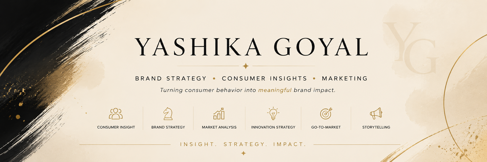

# Hi, I'm Yashika Goyal 👋

**Economics Graduate | Brand Strategy | Consumer Insights | Marketing**

I’m an Economics graduate from Shri Ram College of Commerce (SRCC) with a passion for turning consumer behaviour into commercially viable brand ideas.

My work sits at the intersection of **consumer insights, innovation strategy, luxury beauty, and marketing**, where I enjoy translating research into concepts that solve real business problems.

This portfolio brings together two flagship case studies: **corporate innovation** through L'Oréal Brandstorm and **entrepreneurial strategy** through BEAUTY&YOU.

---

## Featured Case Studies

### 01 — L'Oréal Brandstorm 2026: Velum

> Reimagining fragrance from projection to intimacy through an infusion-first luxury ritual.

**My contribution**

- Consumer Insight
- Concept Refinement
- Product Visual Development
- Business Strategy
- Storytelling

**Tools used:** Canva · AI-assisted ideation, research synthesis and creative development

➡️ **[Explore the L'Oréal Brandstorm Portfolio Case Study](https://github.com/02goyalyashika-blip/L-oreal-Brandstorm-2026)**

---

### 02 — BEAUTY&YOU: The Beauty That Never Ends

> A Circular Beauty Infrastructure concept exploring how brands, consumers, retailers and circularity partners can stay connected after purchase.

**My work**

- Market Research
- Consumer Research
- Strategic Reframing
- MVP Design
- Business Model Design

**Tools used:** AI-assisted market research · creative exploration · innovation development · strategic reframing

➡️ **[Explore the BEAUTY&YOU Portfolio Case Study](https://github.com/02goyalyashika-blip/Beauty-You)**

➡️ **[View the Portfolio Index](PORTFOLIO_INDEX.md)**

---

## Core Capabilities

---

## Currently Exploring

- Luxury Beauty Strategy
- Consumer Research
- FMCG Brand Management
- Product Strategy
- Marketing Innovation

---

## Let's Connect

💼 LinkedIn: [yashika-goyal-91aa761b1](https://www.linkedin.com/in/yashika-goyal-91aa761b1/)

📂 [Portfolio Index](PORTFOLIO_INDEX.md)

📍 Delhi, India

---

## A Thought I Work By

> *I believe the strongest brands don't begin with products—they begin with understanding people. My goal is to turn consumer insight into strategies that create lasting business impact.*
